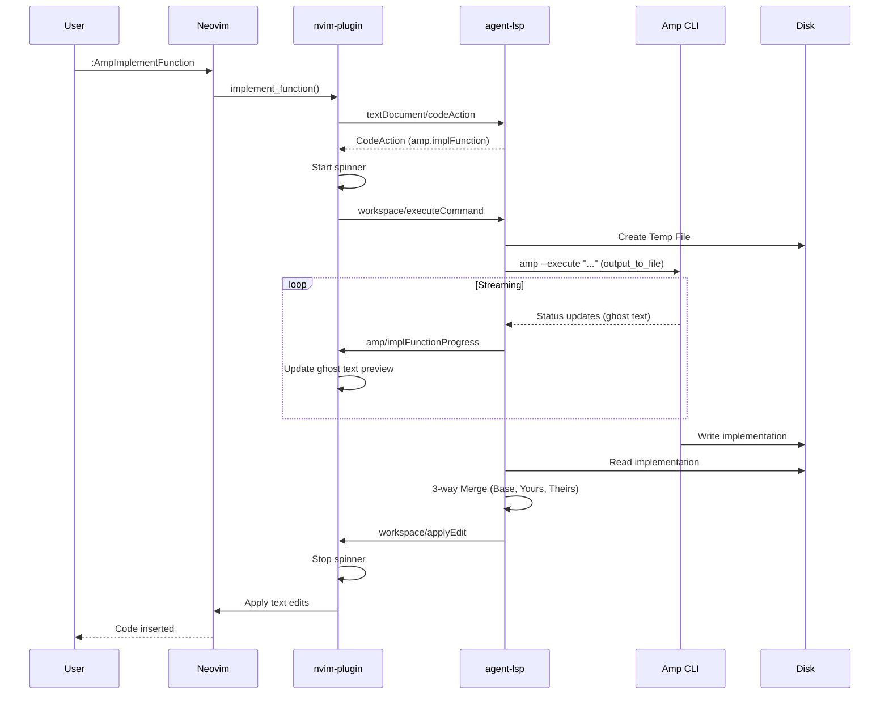
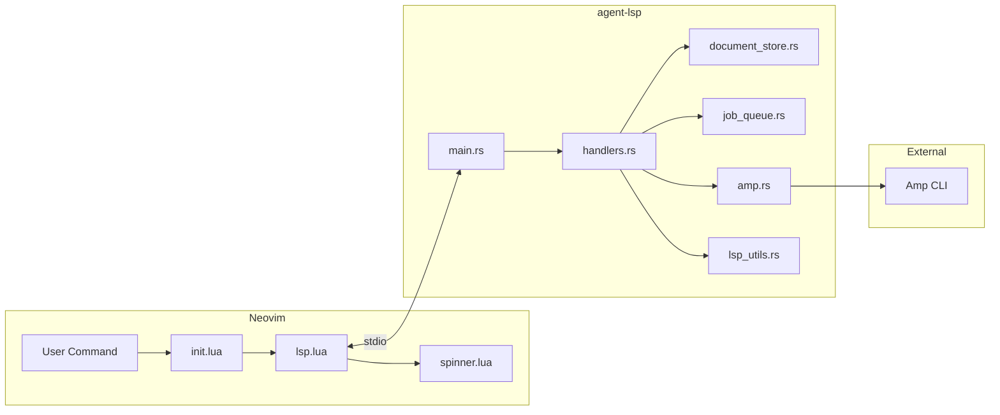

# agent.nvim

Agentic coding for Neovim — AI-powered function implementation using [Amp](https://ampcode.com).

## Overview

agent.nvim provides a seamless integration between Neovim and the Amp AI coding assistant. It consists of two components:

1. **agent-lsp**: A Rust-based LSP server that bridges Neovim and the Amp CLI
2. **nvim-plugin**: A Lua plugin that provides the user interface and LSP client management

## Features

- **`:AmpImplementFunction`** — Implement the function at the cursor position using AI
- **Streaming progress** — See incremental AI output as ghost text while the implementation is being generated
- **Concurrent implementations** — Implement multiple functions simultaneously with per-file serialization
- Animated spinner feedback while waiting for AI response (supports multiple concurrent spinners)
- Automatic code insertion via LSP workspace edits with line tracking
- **3-way merge** — Smart merging of AI-generated code with user edits to prevent conflicts
- Language-agnostic design (works with any programming language)

## Requirements

- [Amp CLI](https://ampcode.com) installed and available in PATH
- Neovim 0.10+
- Rust toolchain (for building the LSP server)

## Installation

### 1. Build the LSP Server

```bash
# Clone the repository
git clone https://github.com/yuvaldolev/agent.nvim.git
cd agent.nvim

# Build the LSP server
cargo build --release
```

### 2. Install the Neovim Plugin

Using [lazy.nvim](https://github.com/folke/lazy.nvim):

```lua
{
    dir = "/path/to/agent.nvim/nvim-plugin",
    config = function()
        require("agent_amp").setup()
    end,
}
```

The plugin automatically locates the `agent-lsp` binary using the following resolution order:

1. **User-specified `cmd`** — if provided in `setup()`
2. **PATH lookup** — `agent-lsp` found via `vim.fn.exepath()`
3. **Release build** — `<project-root>/target/release/agent-lsp`
4. **Debug build** — `<project-root>/target/debug/agent-lsp`

This means you can simply build with `cargo build --release` and the plugin will find the binary automatically.

### Configuration Options

```lua
require("agent_amp").setup({
    -- Optional: override automatic binary detection
    cmd = { "/custom/path/to/agent-lsp" },
})
```

## Usage

1. Open a file in Neovim
2. Position your cursor on a function with `todo!()` or similar placeholder
3. Run `:AmpImplementFunction`
4. Wait for the spinner to complete — the implementation will be inserted automatically

You can also call the function programmatically:

```lua
require("agent_amp").implement_function()
```

Or create a custom keybinding:

```lua
vim.keymap.set("n", "<leader>ai", require("agent_amp").implement_function, { desc = "Implement function with Amp" })
```

## Running Tests

```bash
# Run all tests
cargo test

# Run only e2e tests
cargo test --test e2e_test

# Run a specific test
cargo test test_initialization

# Run ignored tests (require amp CLI to be available)
cargo test --test e2e_test -- --ignored --nocapture
```

### Test Coverage

| Test | Description |
|------|-------------|
| `test_initialization` | Verifies LSP handshake and server capabilities |
| `test_did_open_and_code_action` | Tests document tracking and code action generation |
| `test_did_change` | Tests incremental document sync with text edits |
| `test_completion_returns_null` | Verifies completion stub returns null |
| `test_unknown_request_returns_error` | Verifies unknown methods return MethodNotFound error |
| `test_execute_command_prints_modifications` | *(ignored)* Calls amp CLI and prints workspace edits |
| `test_single_function_modification` | *(ignored)* Verifies targeted function modification |
| `test_concurrent_implementations` | *(ignored)* Tests concurrent function implementations across multiple files |

## Architecture



### Component Design

#### LSP Server (`src/`)

The LSP server is built with the `lsp-server` crate (from rust-analyzer) using stdio transport.

```
src/
├── main.rs           # Server struct, initialization, message loop
├── handlers.rs       # Request and notification handlers
├── document_store.rs # In-memory document tracking
├── job_queue.rs      # Per-file job serialization with line tracking
├── amp.rs            # Amp CLI integration
└── lsp_utils.rs      # LSP response helpers and workspace edit builder
```

**Key Design Decisions:**

- **Language agnostic**: The server does not parse code. It passes cursor position and file contents to the Amp CLI, which determines function context.
- **Incremental sync**: Uses `TextDocumentSyncKind::INCREMENTAL` for efficient document updates.
- **Per-file serialization**: Uses `JobQueue` to serialize concurrent implementations within the same file, preventing race conditions when line numbers shift.
- **Line tracking**: Pending jobs have their line numbers automatically adjusted when earlier implementations are applied.
- **Versioned edits**: `WorkspaceEdit` includes `VersionedTextDocumentIdentifier` for concurrency safety.
- **Logging**: Uses `tracing` crate, outputting to stderr (required since stdio is used for LSP transport).

**LSP Capabilities:**

| Capability | Description |
|------------|-------------|
| `textDocument/didOpen` | Track opened documents |
| `textDocument/didChange` | Incremental sync to DocumentStore |
| `textDocument/completion` | Stub (returns null) |
| `textDocument/codeAction` | Returns "Implement function with Amp" action |
| `workspace/executeCommand` | Handles `amp.implFunction`, calls Amp CLI |
| `amp/implFunctionProgress` | Server-to-client notification with streaming preview text |

#### Neovim Plugin (`nvim-plugin/`)

The plugin is organized as a standard Neovim Lua plugin:

```
nvim-plugin/
├── plugin/
│   └── agent_amp.lua    # Auto-loads and calls setup()
└── lua/agent_amp/
    ├── init.lua         # Main module, setup(), user commands
    ├── lsp.lua          # LSP client management
    └── spinner.lua      # Animated progress indicator
```

**Modules:**

| Module | Description |
|--------|-------------|
| `init.lua` | Plugin entry point. Creates `AgentAmp` instance, registers `:AmpImplementFunction` command, handles progress callbacks |
| `lsp.lua` | `LspClient` class. Manages LSP lifecycle, automatic binary resolution, handles `workspace/applyEdit` and `amp/implFunctionProgress` notifications |
| `spinner.lua` | `SpinnerManager` class. Manages multiple concurrent spinners with job tracking, 40s timeout and ghost text preview support |

**Binary Resolution (`lsp.lua`):**

The `LspClient:_resolve_cmd()` method implements automatic binary discovery:
1. Returns user-specified `cmd` if provided
2. Searches PATH for `agent-lsp`
3. Falls back to `target/release/agent-lsp` or `target/debug/agent-lsp` relative to the project root

### Data Flow



### Message Protocol

The LSP server and Neovim communicate using the [Language Server Protocol](https://microsoft.github.io/language-server-protocol/) over stdio:

1. **Initialization**: Standard LSP handshake with capability negotiation
2. **Document Sync**: `didOpen`/`didChange` notifications keep server's DocumentStore in sync
3. **Code Actions**: Returns `amp.implFunction` command when cursor is in a document
4. **Execute Command**: Runs Amp CLI with file context, returns `workspace/applyEdit`

### Amp CLI Integration

The `AmpClient` invokes the Amp CLI with:

```bash
amp --execute "<prompt>" --stream-json
```

The prompt includes:
- Cursor position (line, character)
- Language ID
- Full file contents
- **Output Path**: A path to a temporary file where the Agent should write the result

The LSP server listens to `stdout` for status updates:
- **`type: "assistant"`** messages contain incremental text/status, used for ghost text preview
- **`type: "result"`** / completion: The server reads the final implementation from the temporary file.

## Development

```bash
# Type check
cargo check

# Build debug
cargo build

# Build release
cargo build --release

# Run the server directly (for debugging)
cargo run
```

## License

See [LICENSE](LICENSE) for details.
